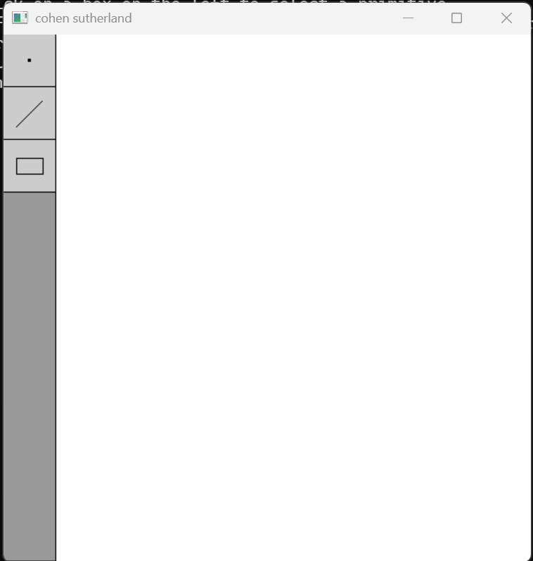
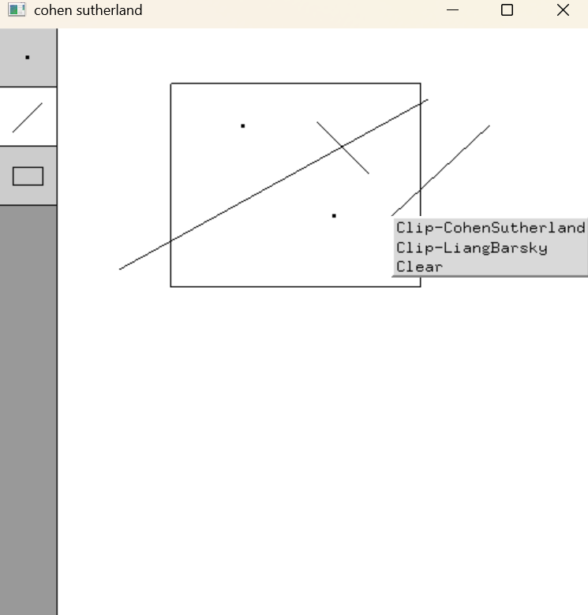
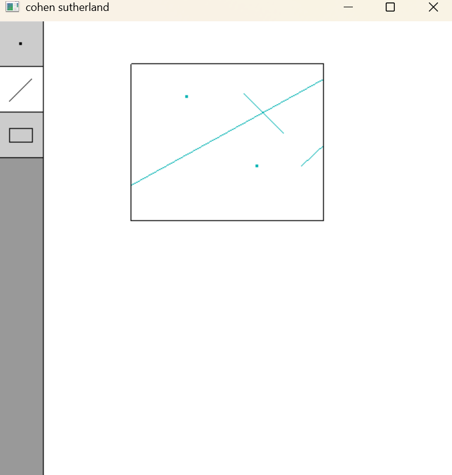

# 2D Primitive Drawing and Clipping Application

This application implements basic 2D drawing functionality and two line clipping algorithms: **Cohen-Sutherland** and **Liang-Barsky**. It allows users to draw points, lines, and rectangles, and then perform clipping within a defined rectangular boundary.

## Images

<div align="center">
    
    
    
</div>


## Features

- **Draw Primitives**: Create points, lines, and rectangles.
- **Clipping Algorithms**: 
  - **Cohen-Sutherland Clipping**: Standard line-clipping algorithm.
  - **Liang-Barsky Clipping**: Efficient algorithm based on parametric line equations.
- **Interactive Drawing**:
  - Left mouse click to draw primitives.
  - Selection menu for choosing the primitive to draw.
  - Clear the scene and apply clipping dynamically.

## Prerequisites

1. **GLUT (OpenGL Utility Toolkit)**: Required for handling windowing and input functionality.
2. **GLEW (OpenGL Extension Wrangler)**: Ensures support for modern OpenGL functionality.
3. **C++ Compiler**: GCC or any equivalent supporting modern C++ (e.g., C++11 or later).

## Compilation

Use the following command to compile the application (assuming GLUT and GLEW are properly installed):

```bash
 g++ -o clipping_OpenGL main.cpp -lGL -lGLU -lGLEW -lglut
```

## Running the Application

Execute the compiled binary:

```bash
./clipping_OpenGL
```

### Controls

- **Left Mouse Button**: Draws the selected primitive.
- **Keyboard**:
  - `ESC`: Exit the application.
  - Implemented `mouseControl` logic for scene interaction.

## Functionalities

### Drawing
- Points, lines, and rectangles can be drawn by selecting appropriate modes.

### Selection Menu
- A vertical selection menu helps switch between drawing modes.
- Selection options appear as UI icons on the left-hand side of the window.